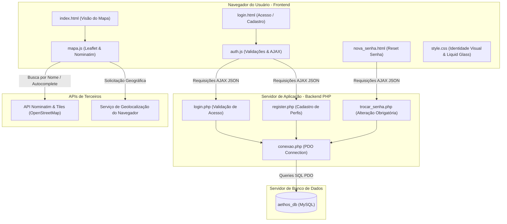
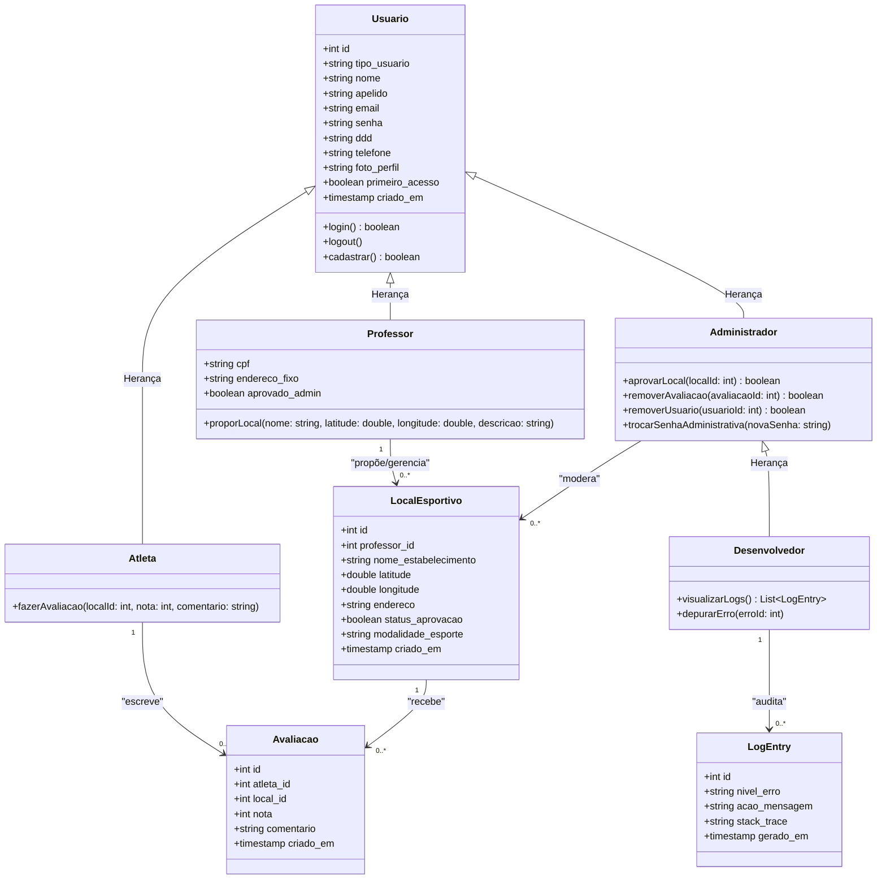
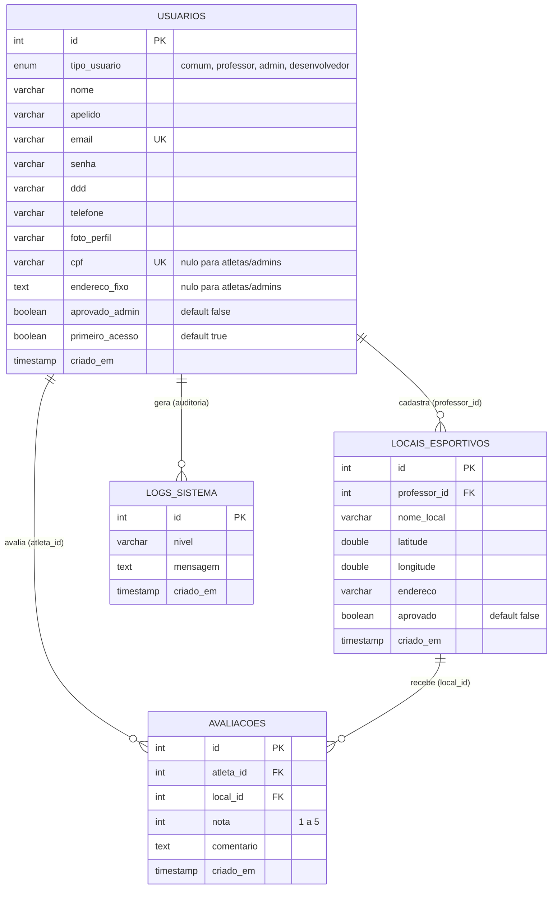
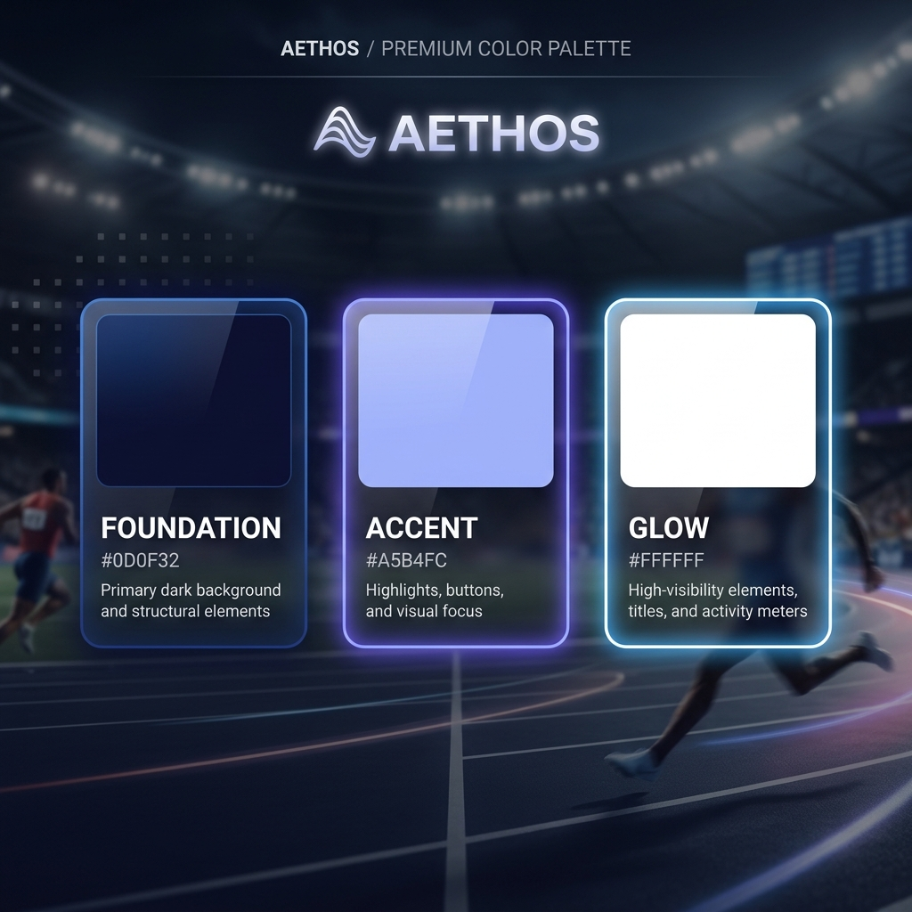
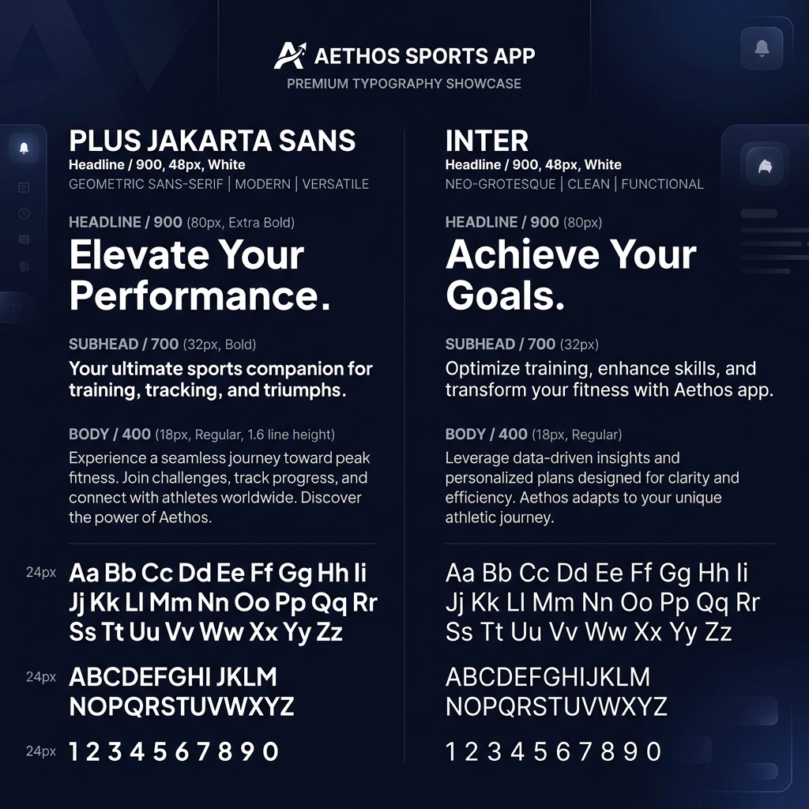

# 5. PROJETO DE SOFTWARE

Diante dos problemas de mobilidade urbana e da dificuldade em localizar pontos de prática esportiva na região, a equipe propôs o desenvolvimento do **Aethos**, uma aplicação web *mobile-first* modularizada para *desktop*. A escolha por uma aplicação web fundamenta-se na facilidade de distribuição, independência de instalação de pacotes em lojas de aplicativos e alta compatibilidade cross-platform (iOS, Android, Windows, macOS).

O sistema opera sob o padrão cliente-servidor de três camadas:
1. **Camada de Apresentação (Frontend)**: Construída de forma modular utilizando HTML5, CSS3 (Tailwind CSS e Liquid Glassmorphic styling) e lógica cliente em **jQuery/JavaScript**, integrando APIs geográficas diretamente no navegador.
2. **Camada de Aplicação/Negócio (Backend)**: Desenvolvida em **PHP**, responsável pelas validações de regras de negócios (verificação de CPF, checagem de e-mails existentes, gerenciamento de sessões seguras e controle de autenticação administrativa).
3. **Camada de Dados (Banco de Dados)**: Gerenciada pelo SGBD **MySQL**, garantindo consistência relacional e armazenamento seguro por meio de hashing BCRYPT para senhas.

---

## 5.1 Concepção do software

A arquitetura do Aethos baseia-se em baixo acoplamento e independência de componentes. O diagrama de componentes a seguir descreve a organização modular do frontend, do backend PHP e sua comunicação com o banco de dados e APIs externas.

### Figura 1 - Diagrama de Componentes do Sistema Aethos



O diagrama de implantação abaixo ilustra a topologia física da infraestrutura, detalhando onde cada processo é executado e quais protocolos de comunicação são utilizados na integração.

### Figura 2 - Diagrama de Implantação do Sistema Aethos

```mermaid
deploymentDiagram
    node DispositivoCliente ["Dispositivo Cliente (Smartphone / Desktop)"] {
        node Navegador ["Navegador Web (Chrome/Safari/Firefox)"] {
            artifact FrontendApp ["Aethos Frontend (HTML/CSS/JS)"]
        }
    }

    node ServidorAplicacao ["Servidor de Aplicação (Apache / Nginx)"] {
        node InterpretadorPHP ["Motor PHP 8.x"] {
            artifact ScriptsPHP ["Scripts Backend (login, register, trocar_senha)"]
        }
    }

    node ServidorDados ["Servidor de Banco de Dados (MySQL / MariaDB)"] {
        database DB ["SGBD MySQL (aethos_db)"]
    }

    node NuvemOpenStreetMap ["Servidores OSM & Nominatim"] {
        artifact MapTiles ["Map Tiles & Geocoding API"]
    }

    Navegador -- "HTTPS (Porta 443)" --> ServidorAplicacao : "Consome rotas backend"
    Navegador -- "HTTPS (Porta 443)" --> NuvemOpenStreetMap : "Carrega tiles do mapa / autocomplete"
    ScriptsPHP -- "TCP/IP (PDO Port 3306)" --> DB : "Manipula entidades de usuários e locais"
```

---

## 5.2 Requisitos funcionais e não-funcionais

A engenharia de requisitos do Aethos seguiu as regras de especificação de software para garantir que todas as necessidades dos perfis de usuário (Atleta, Professor, Administrador e Desenvolvedor) fossem mapeadas com clareza.

### Tabela 1 - Requisitos Funcionais do Sistema Aethos

| ID | Nome | Descrição | Prioridade | Tipo |
| :--- | :--- | :--- | :--- | :--- |
| **RF01** | Cadastro de Usuários (Atletas) | Permitir que o usuário comum se cadastre informando Foto de perfil, Nome completo, Apelido (opcional), DDD, Telefone de contato, E-mail e Senha. | Alta | Cadastro |
| **RF02** | Cadastro de Professores | Permitir o cadastro de usuários-professores com campos adicionais obrigatórios: Endereço Fixo e CPF verídico. | Alta | Cadastro |
| **RF03** | Validação de CPF | Validar o CPF do professor no ato do cadastro para certificar sua autenticidade física. | Alta | Regra de Negócio |
| **RF04** | Autenticação por Perfil | Efetuar login diferenciando os níveis de acesso: Usuário Comum, Professor, Administrador e Desenvolvedor. | Alta | Segurança |
| **RF05** | Login de Desenvolvedor por Nome | Permitir que desenvolvedores acessem o sistema digitando o nome (Lorrany, Arthur, Nepo, Leo, Joaquim) em vez de e-mail. | Alta | Segurança |
| **RF06** | Troca Obrigatória de Senha | Exigir a substituição imediata da senha padrão (`senha123`) de Administradores e Desenvolvedores no primeiro acesso ao sistema. | Alta | Segurança |
| **RF07** | Ocultar/Exibir Senhas | Fornecer um botão visual (ícone de olho aberto/fechado) nos campos de senha em todas as telas de autenticação. | Média | Interface |
| **RF08** | Solicitação Prévia de Localização | Emitir um aviso/permissão de segurança ao usuário solicitando acesso à sua geolocalização antes de abrir o mapa. | Alta | Geolocalização |
| **RF09** | Centralização Automática no Mapa | Centralizar a tela de navegação geográfica na localização GPS obtida do usuário após o aceite da permissão. | Alta | Interface |
| **RF10** | Cadastro de Locais Esportivos | Permitir que o Usuário-Professor envie formulário de local, dojo, academia ou espaço de trabalho para alocação de ponto no mapa. | Alta | Cadastro |
| **RF11** | Moderação Administrativa de Locais | Exigir a aprovação prévia do Administrador para alocar novos locais propostos por professores no mapa público. | Alta | Regra de Negócio |
| **RF12** | Avaliação e Comentários | Permitir que atletas autenticados enviem avaliações (notas) e comentários sobre locais esportivos e professores (sistema similar ao Uber). | Média | Interação |
| **RF13** | Painel do Desenvolvedor (Intranet) | Disponibilizar aos desenvolvedores um terminal de logs detalhados de ações e descrição completa de erros gerados no sistema. | Alta | Gerenciamento |
| **RF14** | Gerenciamento Administrativo profundo | Permitir que administradores e desenvolvedores excluam contas de usuários, aprovem locais cadastrados e removam comentários inadequados. | Alta | Moderação |
| **RF15** | Recuperação de Senha por E-mail | Enviar código de verificação para o e-mail previamente cadastrado para autenticar e autorizar a troca de senha do usuário. | Média | Comunicação |

### Tabela 2 - Requisitos Não Funcionais do Sistema Aethos

| ID | Nome | Descrição | Categoria | Norma |
| :--- | :--- | :--- | :--- | :--- |
| **RNF01** | Compatibilidade Cross-Browser | O sistema deve renderizar e operar perfeitamente no Google Chrome, Safari, Mozilla Firefox e Microsoft Edge. | Compatibilidade | ISO 25010 |
| **RNF02** | Design Responsivo (Mobile-First) | A interface deve ser adaptável a diferentes resoluções, com foco prioritário em telas de celulares e redimensionável para desktop. | Usabilidade | ISO 25010 |
| **RNF03** | Proteção de Dados (LGPD) | Dados de CPF e informações de contato sensíveis devem ser armazenados de acordo com os princípios de segurança da LGPD. | Segurança | LGPD |
| **RNF04** | Criptografia de Credenciais | Senhas de acesso devem ser criptografadas de forma irreversível utilizando o algoritmo seguro Bcrypt no banco de dados. | Segurança | ISO 27001 |
| **RNF05** | Tempo de Resposta Geográfica | A renderização de pins próximos no mapa deve ser concluída em no máximo 2 segundos após a obtenção da geolocalização. | Desempenho | ISO 25010 |
| **RNF06** | Disponibilidade da Aplicação | O sistema deve estar operacional 99,5% do tempo anual para livre acesso dos atletas e professores. | Confiabilidade | ISO 25010 |
| **RNF07** | Controle de Acesso Baseado em Perfis | Restringir o acesso a rotas do PHP por verificação de variáveis de sessão seguras (`$_SESSION['tipo_usuario']`). | Segurança | ISO 25010 |
| **RNF08** | Geolocalização de Alta Precisão | Usar o parâmetro `enableHighAccuracy: true` na API de geolocalização para melhorar a precisão da localização do usuário. | Confiabilidade | ISO 25010 |
| **RNF09** | Armazenamento Local de Logs | Erros e logs do sistema devem ser gravados em arquivos de log internos protegidos na intranet corporativa. | Manutenibilidade | ISO 25010 |
| **RNF10** | Verificação de Existência de E-mail | Integrar verificação de validação de domínio de e-mail para evitar contas falsas no cadastro de usuários. | Segurança | ISO 25010 |

---

## 5.3 Diagrama de caso de uso

O Diagrama de Caso de Uso define as fronteiras do ecossistema Aethos, relacionando as ações que os atores (Atleta, Professor, Administrador e Desenvolvedor) podem desempenhar na plataforma.

```mermaid
usecaseDiagram
    actor "Usuário Não Autenticado" as Guest
    actor "Usuário Atleta (Comum)" as Atleta
    actor "Usuário Professor" as Professor
    actor "Administrador" as Admin
    actor "Desenvolvedor" as Dev

    Guest --> (Visualizar Mapa Aberto)
    Guest --> (Buscar Locais Próximos)
    Guest --> (Cadastrar Perfil)
    Guest --> (Autenticar-se)

    Atleta --> (Avaliar Local / Professor)
    Atleta --> (Escrever Comentários)
    
    Professor --> (Propor Local Esportivo)
    Professor --> (Gerenciar suas Informações)

    Admin --> (Aprovar Propostas de Locais)
    Admin --> (Remover Comentários)
    Admin --> (Gerenciar Contas de Usuários)
    Admin --> (Trocar Senha Obrigatória no 1º Acesso)

    Dev --> (Acessar Painel de Logs de Erros)
    Dev --> (Executar Manutenção do Banco)
    Dev --> (Todas as Ações do Admin)

    (Trocar Senha Obrigatória no 1º Acesso) .> (Autenticar-se) : <<include>>
    (Propor Local Esportivo) .> (Validação de Endereço/CPF) : <<include>>
```

---

## 5.4 Diagrama de classe

O diagrama de classes UML representa a modelagem estática orientada a objetos do sistema, mapeando a estrutura dos perfis de usuários, locais esportivos, interações e auditoria de logs.



---

## 5.5 Diagrama entidade-relacionamento

O modelo lógico relacional do banco de dados `aethos_db` reflete a estrutura física definida no arquivo [database.sql](file:///e:/Desktop/NEPO/PROGRAMACAO/DSI/AETHOS/backend/database.sql), estendido logicamente para modelar os relacionamentos de locais esportivos propostos pelos professores e as avaliações dos atletas.



---

## 5.6 Identidade visual do software

A identidade visual do Aethos Lab foi inteiramente projetada com base nos estudos estéticos destilados no laboratório do produto, buscando um equilíbrio moderno entre profundidade e refração digital por meio do efeito *Liquid Glass* (estilo glassmorfismo premium com alta transparência e blur sutil).

### Paleta de Cores (Regra 70-20-10)

O sistema de cores adota a distribuição proporcional para garantir conforto visual em telas noturnas (Dark Mode nativo) sem perder contraste em elementos de destaque:

```
[#0D0F32] - Foundation (70%)
  | Profundidade noturna azul-escura profunda, utilizada para planos de fundo gerais e contêineres principais.
  
[#A5B4FC] - Accent (20%)
  | Azul-lilás etéreo com alta saturação, aplicado em elementos de ação prioritária (CTAs), botões e realces dinâmicos.
  
[#FFFFFF] - Glow (10%)
  | Branco puro luminoso, aplicado a textos prioritários, títulos e ícones para assegurar máxima legibilidade.
```

#### Figura 5 - Paleta de Cores do Sistema Aethos


### Tipografia

A tipografia do Aethos prioriza fontes modernas com desenho geométrico e alto nível de legibilidade para telas digitais móveis e de desktop:

*   **Headline / 900 (Títulos de Destaque)**:
    *   **Família**: `Plus Jakarta Sans` ou `Inter`
    *   **Uso**: Logotipo Aethos, títulos de seções principais da plataforma.
*   **Subhead / 700 (Subtítulos)**:
    *   **Família**: `Plus Jakarta Sans` ou `Inter`
    *   **Uso**: Títulos de modais, cabeçalhos de formulários e contêineres.
*   **Body / 400 (Texto Corrido e Leitura)**:
    *   **Família**: `Inter` ou `Syafixy`
    *   **Uso**: Comentários, avaliações, descrições de locais esportivos e inputs de formulário.

#### Figura 6 - Tipografia do Sistema Aethos


### Estilo de Componentes de Interface

1.  **Efeito Liquid Glass (Camadas de Vidro)**:
    Os painéis sobrepostos ao mapa dinâmico (caixa de busca, modais de login e painel de logs) adotam o estilo glassmórfico:
    ```css
    background: rgba(13, 15, 50, 0.75);
    backdrop-filter: blur(12px) saturate(180%);
    border: 1px solid rgba(165, 180, 252, 0.15);
    ```
2.  **Botões Principais (CTAs)**:
    Arredondados e contrastantes, utilizam a cor de acento `#A5B4FC` como fundo e texto escuro para legibilidade.
3.  **Botões Secundários**:
    Bordas finas com a cor de acento `#A5B4FC` e fundo transparente ou sutilmente translúcido.
